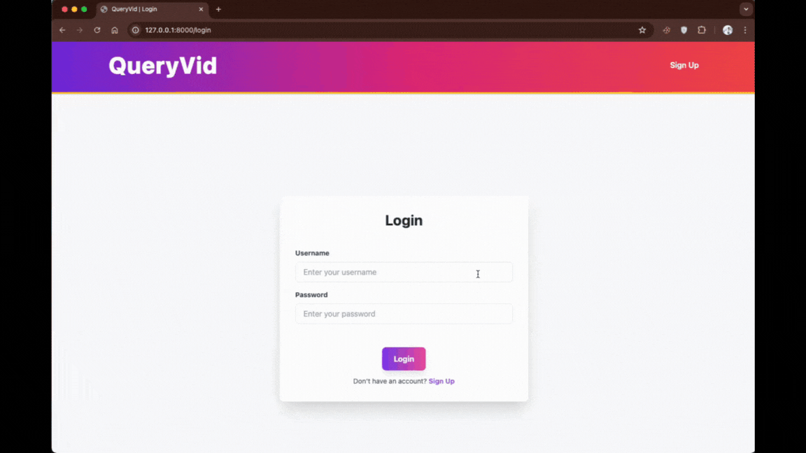
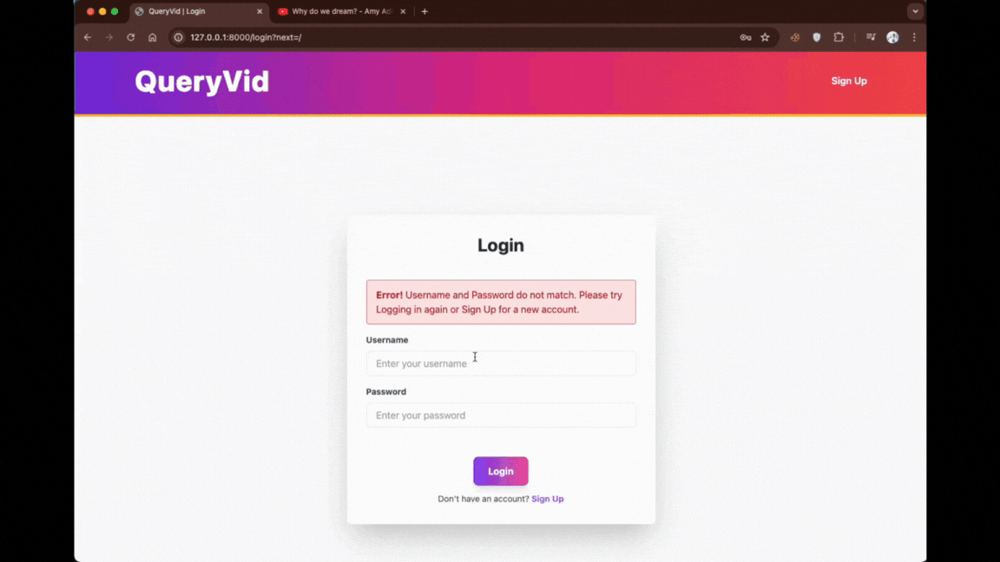
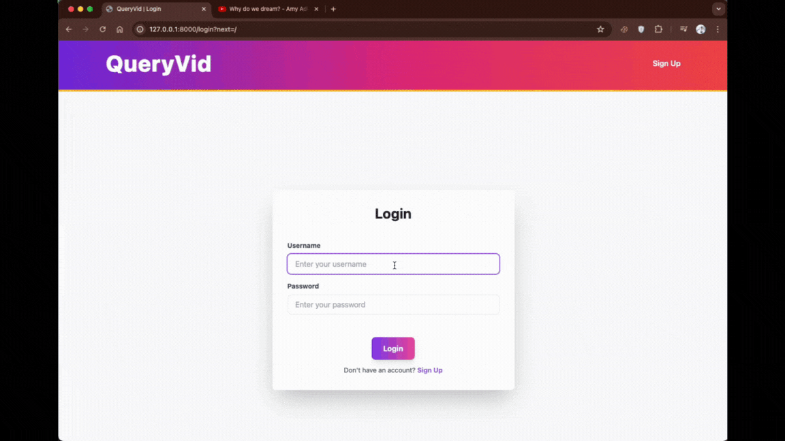

# QueryVid

## _Ask Videos Anything_

### Project Description

In the digital age, video content has become a primary source of information, yet extracting specific details from lengthy YouTube videos remains a challenge. _**QueryVid**_ aims to solve this by providing a seamless interface for querying YouTube video content. By leveraging advanced APIs for video transcription and natural language processing, QueryVid allows users to obtain precise answers to their questions based on the content of the video, thereby enhancing information accessibility and efficiency for developers and users alike.

### Demo

#### Signup



#### Generating an Answer



#### Query History and Logout


#### Error Handling



### Getting Started

To run QueryVid on your local machine, follow these steps:

1. Ensure you have the latest version of Python and pip installed.

2. Clone the repository:

   ```sh
   git clone https://github.com/aniiishhh/QueryVid.git
   cd QueryVid
   ```

3. Create and activate a Python virtual environment:

   ```sh
   python -m venv venv
   source venv/bin/activate  # On Windows use `venv\Scripts\activate`
   ```

4. Install the required packages:

   ```sh
   pip install -r requirements.txt
   ```

5. Get your API keys:

   - [AssemblyAI API Key](https://www.assemblyai.com/)
   - [OpenAI API Key](https://platform.openai.com/)

6. Host a demo PostgreSQL database locally or on cloud services (suggested: [Render](https://render.com/)).

7. Enter the database details and the API keys in the `.env` file in the root directory. Your `.env` file should look something like this:

   ```
   ASSEMBLYAI_API_KEY = your_assemblyai_api_key
   OPENAI_API_KEY = your_openai_api_key

   DB_ENGINE = "django.db.backends.postgresql_psycopg2"
   DB_NAME = your_db_name
   DB_USER = your_db_user
   DB_PASSWORD = your_db_password
   DB_HOST = your db_host
   DB_PORT = your db_port
   ```

8. Finally, run the application:
   ```sh
   python manage.py runserver
   ```

Now you can open your web browser and navigate to `http://127.0.0.1:8000/` to try out the app.

### Tools Used

**Frontend:** HTML, Tailwind CSS, JavaScript  
**Backend:** [Python](https://www.python.org/), [Django](https://www.djangoproject.com/)  
**Database:** PostgreSQL  
**APIs:** [AssemblyAI Speech-to-Text API](https://www.assemblyai.com/), [OpenAI GPT-3.5-turbo API](https://platform.openai.com/)

### Project Overview

QueryVid is designed to provide a user-friendly interface for querying YouTube video content. Users can sign up and log in to access the main features of QueryVid, ensuring that their queries and history are securely stored and accessible only to them. Once logged in, users enter a valid YouTube video link and a question into the provided input fields. The backend processes this request by extracting video details and downloading the audio file using the `yt_dlp` library.

The audio file is then transcribed into text using the AssemblyAI API. This transcription is sent to the OpenAI GPT-3.5-turbo model along with the user's question. The model generates an answer based on the video content. If the task is successful, the query details and results are stored in a PostgreSQL database for future reference, accessible in the query history section.

QueryVid's frontend is crafted with HTML and Tailwind CSS, providing a responsive and visually appealing user experience. JavaScript is used to enhance interactivity and ensure smooth transitions and animations. The backend is powered by Django, which handles the business logic and integrates seamlessly with the PostgreSQL database to manage user data and query history efficiently.

Robust error handling is incorporated to manage invalid YouTube links, transcription errors, and issues with the OpenAI API. Users receive clear messages to guide them in correcting their input or understanding the error. This ensures a smooth user experience and helps maintain the application's reliability.

### Conclusion

QueryVid is an innovative solution for extracting valuable information from YouTube videos. By combining powerful APIs with a robust backend and a clean, interactive frontend, it delivers a unique and efficient user experience.

The use of yt_dlp for video extraction, AssemblyAI for transcription, and OpenAI's GPT-3.5-turbo for generating answers demonstrates a sophisticated workflow that leverages cutting-edge tools and services.

---

Feel free to reach out or connect with me on [LinkedIn](https://www.linkedin.com/in/anish-k36/) and [GitHub](https://github.com/aniiishhh) for more information or to discuss other projects.
